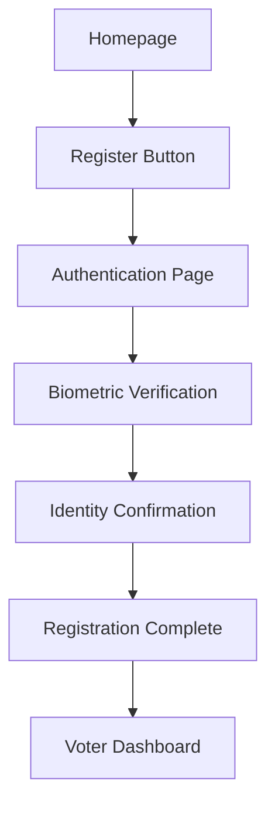
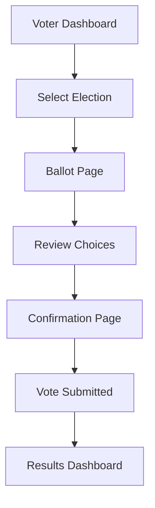
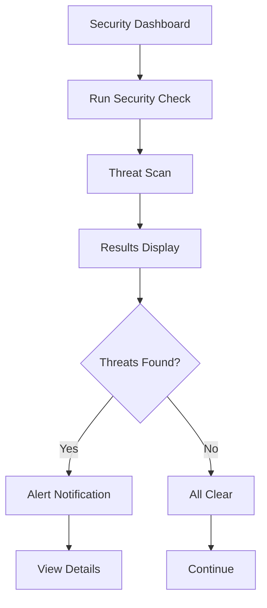

# Animation and Interaction Patterns

## 1. Micro-Interactions

### 1.1 Button Interactions
```
[Primary Button States]
Default: Solid blue background
Hover: Slightly darker blue with subtle scale increase (1.02x)
Active: Inset shadow and scale down (0.98x)
Focus: Blue focus ring with 2px thickness
Disabled: 50% opacity with no hover effects
```

### 1.2 Form Field Feedback
```
[Input Field States]
Default: Light gray border
Focus: Blue border with glow effect
Valid: Green border with checkmark icon
Invalid: Red border with error icon
Loading: Animated spinner on the right side
```

### 1.3 Card Interactions
```
[Card States]
Default: Subtle shadow
Hover: Elevated shadow and slight scale increase (1.01x)
Active: Pressed state with inset shadow
Selected: Blue border highlight
```

### 1.4 Navigation Transitions
```
[Navigation States]
Menu Open: Slide in from left with fade-in effect (300ms)
Menu Close: Slide out to left with fade-out effect (300ms)
Page Transition: Fade transition between pages (500ms)
Link Hover: Underline with smooth expansion (200ms)
```

## 2. Mermaid User Flow Charts

### 2.1 Voter Registration Flow


### 2.2 Voting Process Flow


### 2.3 Security Verification Flow


## 3. Framer Motion Animations

### 3.1 Page Transitions
```javascript
// Fade transition between pages
const pageVariants = {
  initial: { opacity: 0 },
  animate: { opacity: 1 },
  exit: { opacity: 0 }
};

const pageTransition = {
  type: "tween",
  ease: "anticipate",
  duration: 0.5
};
```

### 3.2 Component Entrance Animations
```javascript
// Staggered card entrance
const container = {
  hidden: { opacity: 0 },
  show: {
    opacity: 1,
    transition: {
      staggerChildren: 0.1
    }
  }
};

const item = {
  hidden: { opacity: 0, y: 20 },
  show: { opacity: 1, y: 0 }
};
```

### 3.3 Interactive Element Animations
```javascript
// Button hover effect
const buttonVariants = {
  hover: {
    scale: 1.05,
    transition: { duration: 0.2 }
  },
  tap: {
    scale: 0.95
  }
};
```

### 3.4 Data Visualization Animations
```javascript
// Progress bar animation
const progressBarVariants = {
  initial: { width: 0 },
  animate: { 
    width: "100%",
    transition: { duration: 1, ease: "easeOut" }
  }
};
```

## 4. Functional Animation Principles

### 4.1 Feedback Animations
- **Immediate Response**: Provide instant visual feedback for user actions
- **Status Indication**: Use animations to show system status changes
- **Error Communication**: Animate error states to draw attention
- **Success Confirmation**: Celebrate successful actions with subtle animations

### 4.2 Navigation Animations
- **Spatial Awareness**: Help users understand their location in the app
- **Transition Guidance**: Smoothly guide users between different sections
- **Context Preservation**: Maintain context during navigation transitions
- **Performance Optimization**: Ensure animations don't block user interactions

### 4.3 Data Display Animations
- **Data Loading**: Show progress during data fetching
- **Value Changes**: Animate numerical changes for better comprehension
- **Sorting and Filtering**: Visualize data reorganization
- **Real-time Updates**: Smoothly update live data displays

### 4.4 Security Animations
- **Verification Process**: Visualize authentication steps
- **Threat Detection**: Animate security alerts appropriately
- **Privacy Indicators**: Animate privacy protection status
- **Audit Trail**: Animate audit log entries

## 5. Performance Considerations

### 5.1 Animation Optimization
- **Reduce Motion**: Respect user preference for reduced motion
- **Efficient Properties**: Animate transform and opacity for best performance
- **Frame Rate**: Maintain 60fps for smooth animations
- **Memory Management**: Clean up animation resources properly

### 5.2 Accessibility Animations
- **Pause Controls**: Provide controls to pause animations
- **Contrast Maintenance**: Ensure animations don't reduce contrast
- **Screen Reader Compatibility**: Don't rely solely on animations for information
- **Cognitive Considerations**: Avoid flashing or rapidly changing animations

### 5.3 Mobile Performance
- **Battery Conservation**: Minimize animation intensity on mobile devices
- **Touch Interactions**: Optimize animations for touch input
- **Network Considerations**: Don't block interactions during network requests
- **Hardware Acceleration**: Leverage GPU acceleration for complex animations

## 6. Implementation Guidelines

### 6.1 Animation Library Selection
- **Framer Motion**: Primary library for complex animations
- **CSS Transitions**: For simple state changes
- **SVG Animations**: For custom icons and illustrations
- **Web Animations API**: For programmatic animations

### 6.2 Animation Timing
- **Micro-interactions**: 100-300ms duration
- **Page Transitions**: 300-500ms duration
- **Data Loading**: Indeterminate spinners or progress bars
- **Feedback Animations**: 200-400ms duration

### 6.3 Easing Functions
- **Ease In**: Start slow, end fast (cubic-bezier(0.4, 0, 1, 1))
- **Ease Out**: Start fast, end slow (cubic-bezier(0, 0, 0.2, 1))
- **Ease In Out**: Slow start, fast middle, slow end (cubic-bezier(0.4, 0, 0.2, 1))
- **Linear**: Constant speed (linear)

### 6.4 Animation Testing
- **Cross-Browser Testing**: Ensure animations work consistently
- **Performance Profiling**: Monitor frame rates and CPU usage
- **Accessibility Testing**: Verify animations respect user preferences
- **User Testing**: Gather feedback on animation effectiveness